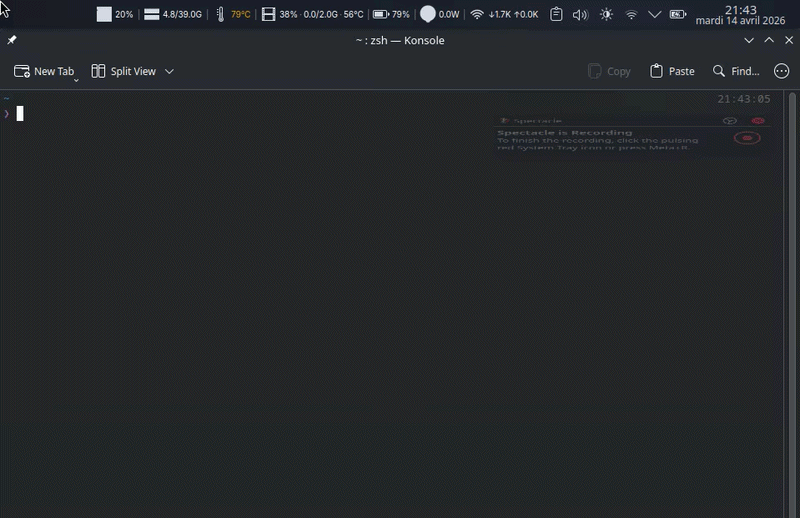

# 🐘 Hadoop Quick Start Docker

A lightweight, Docker-based Hadoop development environment. No 10GB VMs, no VirtualBox kernel issues — just Docker.

> Built as a simpler alternative to the Cloudera QuickStart VM for academic and learning purposes.

---

## Why not the Cloudera QuickStart VM?

| Metric | Cloudera VM | This setup |
| --- | --- | --- |
| Size | ~10 GB | ~1 GB |
| Hadoop version | 2.6 (CDH5) | 3.2.1 |
| Startup time | ~5 min | ~15 sec |
| Kernel issues | Yes (VirtualBox) | None |
| File sharing | Painful | Just drop in `shared/` |

---

## Prerequisites

- [Docker](https://docs.docker.com/get-docker/) installed and running
- Docker Compose (`docker compose` or `docker-compose`)
- Bash (Linux/macOS) or WSL2 (Windows)

---

## Getting Started

|  |
| :----------------------------: |

```bash
# from project root
./setup.sh
./run.sh
```

`run.sh` shows an arrow-key preset menu, then asks how many DataNodes to start (default: `2`).

```text
  Select a preset:
> minimal  — Hadoop only (~1.5 GB)
  standard — Hadoop + Hive (~2.5 GB)
  full     — Hadoop + Hive + HBase (~3.5 GB)
  custom   — pick components
```

| Preset | Services | ~RAM |
| --- | --- | --- |
| minimal | Hadoop (NameNode + DataNodes) | ~1.5 GB |
| standard | + Hive metastore + HiveServer2 | ~2.5 GB |
| full | + HBase Master + RegionServer | ~3.5 GB |
| custom | your choice | varies |

Use arrow keys to select, Enter to confirm. You'll land in an interactive shell inside the NameNode container with Hadoop fully running.

---

## Project Structure

```text
.
├── setup.sh                # One-time local setup (dirs + permissions)
├── run.sh                  # Compose launcher (prompts + scales DataNodes)
├── docker-compose.yml      # NameNode + scalable DataNode + Hive services
├── hadoop.env              # Hadoop config overrides (core/hdfs/yarn/mapred)
├── shared/
│   ├── start-hadoop.sh     # Starts NameNode + YARN + JobHistory
│   ├── start-datanode.sh   # Starts DataNode in DataNode containers
│   ├── compose-namenode.sh # Compose wrapper for NameNode service
│   ├── compose-datanode.sh # Compose wrapper for DataNode service
│   └── (your data files)   # Drop files here to access them in the container
└── data/
  ├── nn/                   # NameNode persistent state
  ├── hive/                 # Hive metastore PostgreSQL persistent state
  └── hbase/                # HBase data directory
```

> `shared/` is your bridge: anything you place here is instantly available inside the container at `/shared`.

---

## Hadoop Config Overrides (`hadoop.env`)

You can override Hadoop properties in [hadoop.env](hadoop.env) without editing scripts.

Examples:

```env
HDFS_CONF_dfs_replication=2
HDFS_CONF_dfs_blocksize=268435456
```

Then restart:

```bash
docker compose down --remove-orphans
./run.sh
```

Tip: if you run only 1 DataNode, keep `HDFS_CONF_dfs_replication=1`.

---

## Loading Files into HDFS

```bash
# 1. Copy your file into shared/ on your laptop
cp ~/Downloads/myfile.csv ~/Desktop/hadoop/shared/

# 2. Inside the container, put it into HDFS
hdfs dfs -mkdir -p /user/root/input
hdfs dfs -put /shared/myfile.csv /user/root/input/

# 3. Verify
hdfs dfs -ls /user/root/input/
```

---

## Web UIs

Once the container is running, open these in your browser:

| UI | URL |
| --- | --- |
| HDFS NameNode | <http://localhost:9870> |
| YARN Resource Manager | <http://localhost:8088> |
| Job History Server | <http://localhost:19888> |
| HiveServer2 (JDBC/Beeline) | `localhost:10000` |
| HBase Master | <http://localhost:16010> |

---

## Useful Commands

```bash
# reconnect to NameNode container
docker compose exec namenode bash
# or by container name
docker exec -it hadoop-namenode bash

# connect to HiveServer2 via Beeline (from host)
docker exec -it hive-server beeline -u jdbc:hive2://localhost:10000

# connect to HiveServer2 via Beeline (from inside NameNode container)
beeline -u jdbc:hive2://hive-server:10000 -n hive

# list cluster containers
docker ps --filter name=hadoop-

# stop and remove cluster
docker compose down --remove-orphans

# start again
./run.sh

# start without attaching shell (CI / scripts)
NO_ATTACH=1 ./run.sh

# start with a specific preset non-interactively (CI / scripts)
PRESET=standard NO_ATTACH=1 ./run.sh
PRESET=full NO_ATTACH=1 ./run.sh

# legacy: start with Hive enabled (still works, maps to standard preset)
START_HIVE=y NO_ATTACH=1 ./run.sh
```

---

## Replication Test (2+ DataNodes)

Start cluster with at least 2 DataNodes, then run:

```bash
hdfs dfs -setrep -w 2 /user/root/tp_bigdata/purchases.txt
```

Verify:

```bash
hdfs fsck /user/root/tp_bigdata/purchases.txt -files -blocks -locations
```

---

## Quick Test — WordCount

```bash
# Create input in HDFS
hdfs dfs -mkdir -p /user/root/input
echo "hello world hello hadoop" > /tmp/test.txt
hdfs dfs -put /tmp/test.txt /user/root/input/

# Run WordCount
hadoop jar $HADOOP_HOME/share/hadoop/mapreduce/hadoop-mapreduce-examples-*.jar \
  wordcount /user/root/input /user/root/output

# Check results
hdfs dfs -cat /user/root/output/part-r-00000
```

---

## Hadoop Version

| Component | Version |
| --- | --- |
| Hadoop | 3.2.1 |
| Java | 8 |
| Base Image | [bde2020/hadoop-base](https://hub.docker.com/r/bde2020/hadoop-base) |
| HBase | 1.2.6 |

---

## HiveServer2 Startup Reliability

`run.sh` uses a layered health-check chain to ensure HiveServer2 is fully ready before handing control back to you — no more "Connection refused" on first connect.

The startup sequence is:

1. NameNode HDFS report passes
2. HDFS `/user/hive/warehouse` directory created and permissioned
3. `hive-metastore` and `hive-server` containers running
4. Metastore thrift port **9083** accepting TCP connections
5. `hive-server` restarted cleanly against the ready metastore
6. HiveServer2 port **10000** accepting TCP connections
7. Beeline JDBC handshake succeeds (`!quit`)

Only after all 7 stages pass does `run.sh` print the cluster summary and drop you into the NameNode shell.

When HBase is active (`full` or `custom` preset with HBase), an additional check waits for:

8. HBase Master port **16010** accepting TCP connections
9. RegionServer registered (Master UI reports 1 live server)

---

## Stopping the Environment

```bash
./stop.sh
```

Re-running `./run.sh` will start fresh automatically.

---

## Quick Test — HBase

```bash
# Open HBase shell
docker exec -it hbase-master hbase shell

# Inside HBase shell (one command per line):
create 'test', 'cf'
put 'test', 'row1', 'cf:name', 'hadoop'
put 'test', 'row2', 'cf:name', 'hbase'
scan 'test'
exit

# Verify HBase is writing to your HDFS (run from inside hadoop-namenode):
hdfs dfs -ls /hbase/data/default/test
```

---

## License

MIT License. See [LICENSE](LICENSE) for details.
